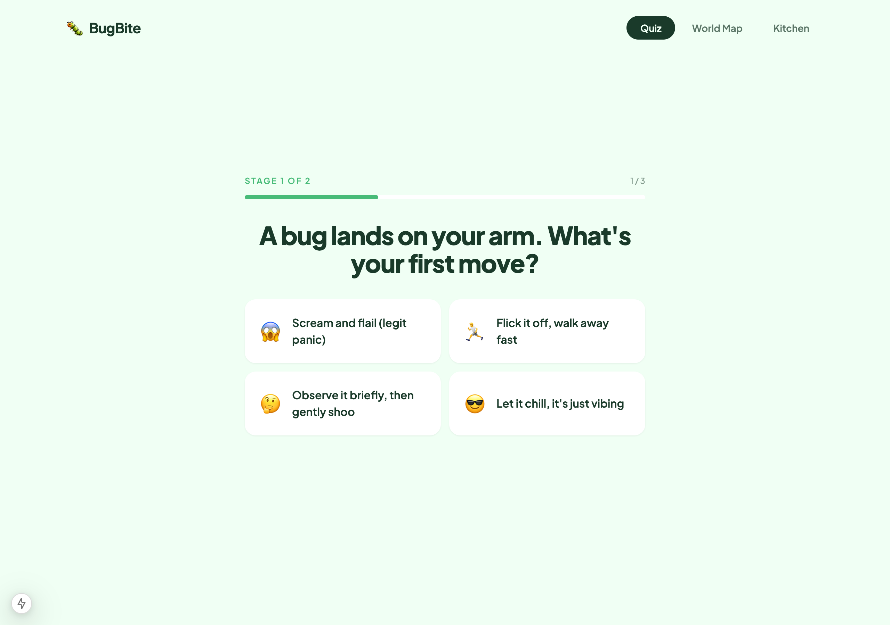
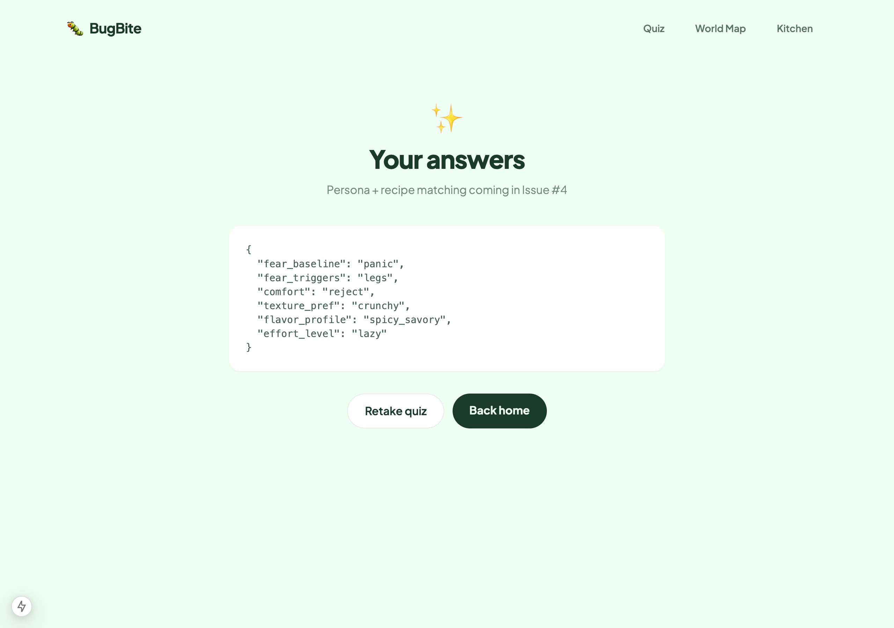

# Bug Report

**Issue Title:** [Bug] Quiz progress label reads "Stage 1 of 2" but the SPEC defines a 3-stage quiz

## Steps to Reproduce

1. Run `npm run dev` and go to `http://localhost:3000/quiz`
2. Click **Let's go →** to start Stage 1
3. Look at the progress bar header on the question screen

## Expected Behavior

Per [`SPEC.md` US-1](../SPEC.md) the quiz is described as a **3-stage** experience: Stage 1 (How Brave Are You?), Stage 2 (What's Your Flavor?), Stage 3 (Your Bug Persona). The progress label should reflect that — for example "Stage 1 of 3" — and Stage 3 (the persona result) should be reachable as part of the same flow.

## Actual Behavior

- The progress label reads **"STAGE 1 OF 2"** (and "STAGE 2 OF 2" in the second batch of questions). See [`app/quiz/page.tsx:24`](../app/quiz/page.tsx) and [`components/QuizProgress.tsx`](../components/QuizProgress.tsx).
- After Stage 2's last question, the user is redirected to `/quiz/result`, which renders only raw JSON ("Persona + recipe matching coming in Issue #4"). The "Stage 3 — Your Bug Persona" screen described in the SPEC does not exist yet, so the labeling and the missing stage compound: users see "Stage 2 of 2" → result page that says the result is incomplete.
- This breaks the SPEC AC: *"Final result screen shows bug persona with name, illustration, personality, fun facts, and edibility info"* and *"Result screen includes 3 personalized recipe recommendation cards based on quiz answers"*.

## Severity

- [ ] Blocker
- [x] Major — core feature (quiz → persona/recipe loop) is incomplete and the labeling misrepresents progress
- [ ] Minor

## Evidence

`screenshots/bug-stage-label-q1.png` (progress label and Q1 of Stage 1):

`screenshots/10-quiz-result-page.png` (result page after Stage 2 — only JSON, no persona):

## Environment

| Detail | Value |
|--------|-------|
| Browser | Chromium (Puppeteer headless) and Safari/Chrome on macOS |
| Device | Desktop |
| OS | macOS 15.2 (Darwin 24.2.0) |
| Deployed or local? | localhost:3000 (`next dev`, commit `62e4dc1`) |

## Related Issue

Related to #3 (3-stage quiz) and #4 (persona + recipe cards).
