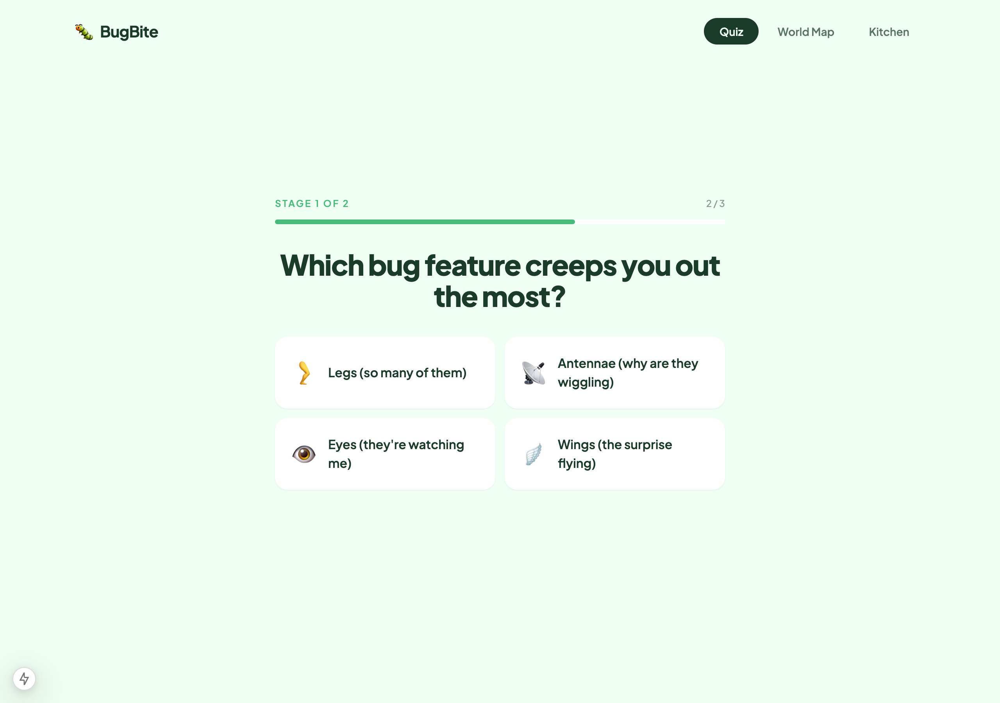

# Bug Report

**Issue Title:** [Bug] Quiz answers auto-advance on click — no Back/Previous button means a single misclick is unrecoverable

## Steps to Reproduce

1. Go to `http://localhost:3000/quiz`
2. Click **Let's go →** to start Stage 1
3. On Q1 ("A bug lands on your arm. What's your first move?"), accidentally click **"Let it chill, it's just vibing"** (or any other option) when you intended to pick a different answer
4. Look for any way to undo or go back to Q1 to change the answer

## Expected Behavior

Either:
1. Selecting an option highlights it but does **not** advance until the user clicks an explicit **Next →** button, **OR**
2. Each question screen shows a **← Back** button so the user can return to a previous question and change their answer.

This is consistent with the SPEC AC *"Quiz can be retaken to get different results"* — currently you can only retake the entire quiz from scratch from the result screen, not correct a single answer mid-flow.

## Actual Behavior

In [`components/QuizQuestionCard.tsx:28`](../components/QuizQuestionCard.tsx) and [`app/quiz/page.tsx:26-46`](../app/quiz/page.tsx), `onAnswer` fires on `onClick` and immediately calls `setQuestionIndex(questionIndex + 1)` (or transitions to the next phase). There is no selected/unselected visual state, no confirmation, and no way to navigate backwards — the only way to fix a misclick is to abandon the current attempt and restart from the very beginning. Since each option button is large and arranged in a 2×2 grid, accidental clicks are realistic, especially on touch devices.

## Severity

- [ ] Blocker
- [x] Major — affects every quiz user; degrades the data quality that drives the recipe-matching loop
- [ ] Minor

## Evidence

`screenshots/bug-misclick-no-undo-q2.png` — after a single click on Q1, the UI has already advanced to Q2 with no way to return:

## Environment

| Detail | Value |
|--------|-------|
| Browser | Chromium (Puppeteer headless), Safari, Chrome on macOS |
| Device | Desktop and Mobile (375×812) |
| OS | macOS 15.2 (Darwin 24.2.0) |
| Deployed or local? | localhost:3000 (`next dev`, commit `62e4dc1`) |

## Related Issue

Related to #3 (3-stage Bug Quiz). May also affect #4 once persona generation runs against possibly-mistaken answers.
